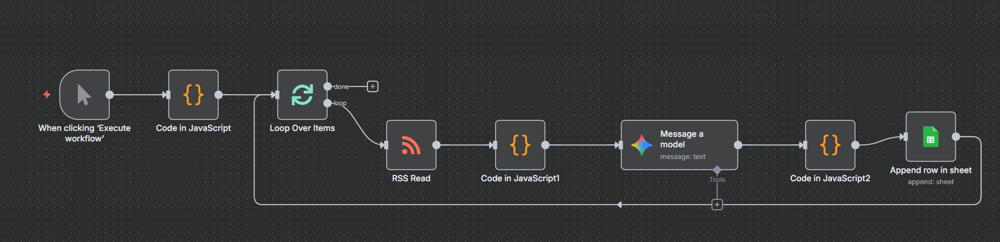

# n8n SEO關鍵字分析工作流五大痛點與解決方案

在建立使用 AI 分析爬取文章的SEO關鍵字的自動化流程時，以下五個環節是我出錯的「雷區」，如果遭遇類似問題，可參考我的處理方式。



## 五大痛點

1. **資料源頭的限制 (RSS Volume Limit)**
   - 涉及節點：
     - RSS Read、Code (Initial Setup)
   - 痛點：
     - RSS Feed 通常只提供最新的 10-20 筆資料。當網站發文頻率極高（如 Black Friday 期間的 The Verge），目標文章（AI 類）會被快速擠出清單，導致後端過濾器抓不到資料。
   - 解決方案：
     - 改用網站提供的 「分類專屬 RSS (Category Feed)」（如 /rss/ai-artificial-intelligence），確保每一筆進來的資料都是高相關性的。

2. **AI 輸出的不可控性 (Non-Standard JSON)**
   - 涉及節點：
     - Message a model (Gemini)、Code (Parsing)
   - 痛點：
     - Gemini 雖然聰明但格式隨性。常出現 Markdown 標記 (```json)、結尾逗號錯誤 (Trailing comma)、或隨意更改欄位名稱，導致標準 JSON.parse 報錯。
   - 解決方案：
     - Prompt 優化：明確要求「純 JSON」、「不要 Markdown」。
     - 代碼暴力解析：不依賴 AI 乖乖聽話，而是用程式碼 substring 鎖定 { 與 } 範圍。
     - 智慧搜尋：編寫遞迴函式 (findKeywords)，無論 AI 把關鍵字藏在哪一層，都能挖出來。

3. **資料流的斷點與繼承 (Data Context Loss)**
   - 涉及節點：
     - Message a model、Code (Merging)
   - 痛點：
     - 經過 AI 節點處理後，原始資料（標題、URL、來源）會被 AI 的回傳結果覆蓋，導致後續節點「失憶」。
   - 解決方案：
     - 索引對應 (Index Matching)。不要過度依賴 n8n 的自動配對 (pairedItem)。使用 $(NodeName).all()[index] 的方式，強制從上游節點抓取對應順序的原始資料進行合併。

4. **迴圈邏輯與連線錯誤 (Loop Wiring)**
   - 涉及節點：
     - Loop Over Items、Google Sheets
   - 痛點：
     - 誤將寫入節點接在 Loop 的 Done 出口，導致只收到迴圈結束訊號，而非處理後的資料；或是沒有正確設定 Loop 批次。
   - 解決方案：
     - 處理單筆資料的節點（AI 分析、寫入 Sheet）必須位於 Loop 的 「內部迴路」 中。Done 出口僅用於「全數執行完畢後」的通知（如寄信通知任務完成）。

5. **隱形字元導致的跑版 (Data Sanitization)**
   - 涉及節點：
     - Code (Final Cleanup)、Google Sheets
   - 痛點：
     - 網頁摘要中常含有不可見的換行符號 (\n, \r) 或 HTML 標籤，導致寫入 Excel/Google Sheet 時格子被撐大、版面錯位。
   - 解決方案：
     - 資料清洗 (Sanitization)。在寫入前增加一個「清潔工」步驟。使用 Regex .replace(/[\r\n]+/g, ' ') 將所有換行強制壓平為空格。

## 工作流通用程度評估

### 高度邏輯通用，低度來源通用

1. **邏輯通用性（高）**:
   - 後端處理邏輯（Regex 過濾 -> AI 分析 -> JSON 容錯解析 -> 資料清洗 -> 寫入資料庫）容易套用到財經新聞分析、社群貼文情感分析、電商產品比價等場景，只需要改 Prompt 和 Sheet 欄位即可。
2. **來源通用性 (中)**：
   - 弱點：
     - 必須手動尋找每個網站的 RSS URL（特別是像 The Verge 這種需要找分類 RSS 的情況）。這意味著如果要新增 50 個網站，需要人工找 50 個連結，且可能需要針對不同媒體的XML結構更改code節點的程式碼。

3. **結論**：
   - 對於個人或中小型專案，目前架構是 CP 值很高的選擇，但不夠「傻瓜」，仍需要一定程度的手工微調。

## 未來優化方向

1. **配置檔管理**：
   - 不要把 URL 硬寫在 Code 裡：
     - 建立一個 Google Sheet，裡面只有兩欄：Site Name 和 RSS URL。
   - n8n 改法：
     - 工作流一開始先讀取這張 Sheet，然後用 Split In Batches 把所有 URL 跑一遍。
   - 好處：
     - 未來要加 50 個網站，只要在 Excel 貼上 50 行網址，完全不用動 n8n 的任何節點。
2.  **引入「真實搜尋數據」**
    - 目標：
      -  驗證 AI 提出的關鍵字是否有流量潛力。
    - 新增節點：HTTP Request (呼叫外部 SEO API)
      - 服務參考：
        - DataForSEO (CP 值高，按次計費)
        - Semrush / Ahrefs API (貴，但數據最準)
        - Google Trends (免費，適合新聞類 SEO)
3. **自動化生成內容大綱**
   - 目標：
     - 讓 AI 根據分析SEO關鍵字的結果，直接產出「寫作指令書」。
   - 新增節點：
     - 第二個 Message a model
   - 設置邏輯：
     - 接在目前的分析流程之後。
     - Prompt：「基於上述的文章摘要、目標受眾、以及 SEO 關鍵字，請為我生成一份繁體中文的部落格文章大綱。包含：H1 標題（要吸引人）、H2 結構、以及每一段建議置入的關鍵字。」
     - Google Docs：新增一個 Google Docs 節點，直接把這份大綱存成一份文件。


 
